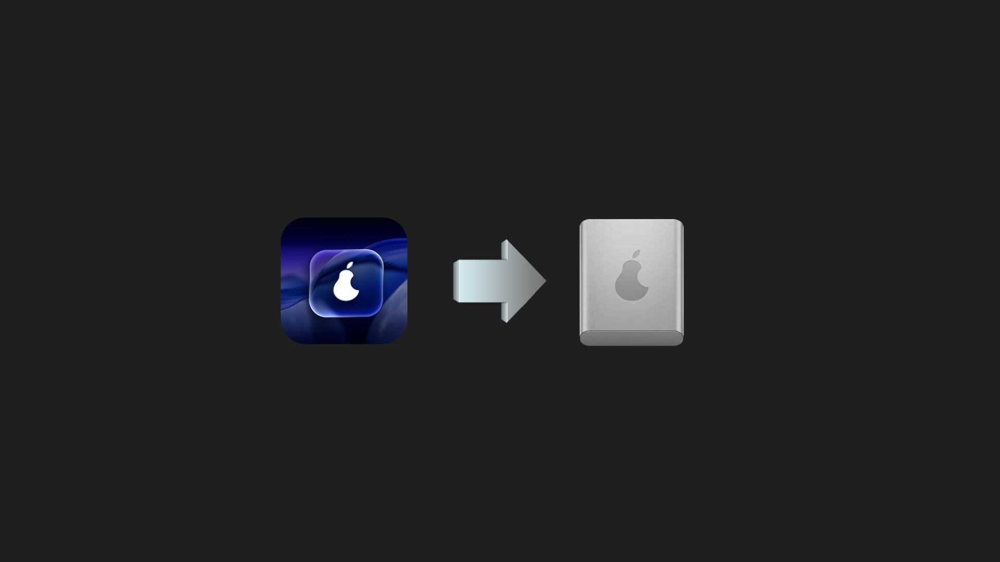

## pearOS Calamares Config

**Calamares** configuration for the **pearOS NiceC0re** distribution, used as the graphical installer for the live system.

### Project structure

- **Global Calamares config**
  - `etc/calamares/settings.conf` – defines the module sequence (welcome, locale, keyboard, partition, users, summary, finished) and enables the `pearOS` branding.
  - `etc/calamares/modules/*.conf` – configuration for standard Calamares modules:
    - `users.conf` – users, default groups, login shell (`/bin/zsh`), preset hostname `pearOS-machine`.
    - `partition.conf`, `mount.conf`, `fstab.conf` – partitioning and mount logic.
    - `packages.conf` – packages to be installed on the target system.
    - `shellprocess-*.conf`, `removeuser.conf`, `unpackfs.conf`, `initcpio*.conf`, etc. – extra install / post‑install steps.

- **pearOS branding**
  - Directory: `etc/calamares/branding/pearOS/`
  - `branding.desc` – product name and version (`26.03`), window mode (fullscreen), sidebar type (`qml,bottom`), image files and slideshow definition (`show.qml`).
  - `stylesheet.qss` – dark theme inspired by macOS:
    - dark background (`#1f1f1f`, `#242424`);
    - blue accent (`#0a84ff`) for focus and primary buttons (`Next`, `Install`, `Done`);
    - modern rounded widgets and input fields.
  - `calamares-sidebar.qml` – custom QML sidebar (installation progress).
  - `show.qml` – QML slideshow with multiple slides (`slide1.png` … `slide6.png`).
  - `lang/calamares-default_*.ts` – translation files for several languages (ar, en, eo, fr, nl).

### Branding assets

According to `branding.desc`, the following images are expected in `etc/calamares/branding/pearOS/`:

- **Logo and icon**
  - `logo.png` – logo used in the Calamares sidebar.
  - `icon.png` – window / application icon.

- **Welcome image**
  - `welcome.png` – central image on the *Welcome* page.

(Optionally, `banner.png` or `wallpaper.png` may also be used if defined in `branding.desc`.)

### Slideshow and screenshot (max Slide 1)

The installation slideshow is defined in `show.qml` and cycles through a series of background images.

```markdown

```

Make sure the `slide1.png` file exists in the branding directory when building the ISO or running Calamares, so that the screenshot renders correctly both in the UI and in this README.

### How to use this configuration

- **Integrate into a live system / ISO**
  - Copy the contents of this repo into `/etc/calamares/` (or the equivalent path used by your ISO builder).
  - Ensure the `calamares` binary is installed in the live image.
  - Ensure all referenced branding files exist (`logo.png`, `icon.png`, `welcome.png`, `slide1.png`, etc.).

- **Run Calamares with this branding**
  - Boot into the pearOS NiceC0re live environment.
  - Launch `calamares` (from the menu or a terminal).
  - The installer should open in fullscreen with the pearOS dark theme, QML sidebar, and custom slideshow.

### Customization notes

- Adjust the installation step order in `settings.conf` (the `sequence` section).
- Change default groups, password policy, and user shell in `users.conf`.
- Tweak colors and overall look & feel in `stylesheet.qss`.
- Replace or extend slideshow images (`slide1.png` … `slide6.png`) and/or their behavior via `show.qml`.

